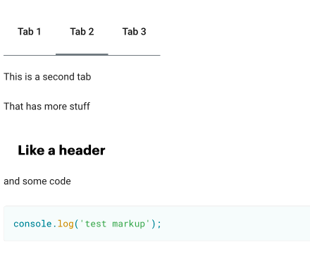

# mParticle Doc Site

This is the repo for the [mParticle doc site](https://docs.mparticle.com/). You can contribute via submitting issues, or by contributing directly to the codebase itself. Read below to learn how to contribute.

-   [CLAs](#cla)
-   [Contributing](#contributinggeneral)
    -   [Branch Guidelines](#branchguidelines)
    -   [Submitting Issues](#submittingissues)
    -   [Contributing to the Codebase](#contributingcodebase)
        -   [Github UI](#githubui)
        -   [Develop and Building Locally](#local)
-   [Sending a Pull Request](#sendingpr)
-   [Example Contribution](#example)
-   [Custom Markdown](#custommarkdown)

<a name="cla"></a>

## CLAs

mParticle requires that all contributers fill out mParticle's Contributor License Agreement (CLA). Before we accept your pull request, you will need to submit a completed CLA. If this is your first PR, a bot will comment sending you to the CLA to sign. The mParticle CLA is available for review [here](https://docs.mparticle.com/cla). You will not be asked to re-sign the CLA unless we revise our CLA.

<a name="contributinggeneral"></a>

## Contributing

<a name="branchguidelines"> </a>

### Branch Guidelines

The repository maintains two primary branches: `master` and `development`:

-   All changes _must be reviewed_ via a pull request into the `development` branch
-   Once per hour during business hours, our build process will merge the `development` branch into `master` and release the site.

**Warning**: Any changes merged into development will be released!!!

<a name="reviewing"></a>
<a name="submittingissues"></a>

### Submitting Issues

Please be sure to check our existing issues before submitting a new issue so that we don't have duplicate content requests. As always, please adhere to our [Code of Conduct](https://github.com/mParticle/docs/blob/master/CODE_OF_CONDUCT.md) when commenting or creating issues.

-   Don't submit issues for small typos - try to fix them yourself using the guidelines in this README :)
-   Elaborate as much as possible about the changes that you'd like to see. If possible, specify the original copy itself when creating an issue.

<a name="contributingcodebase"></a>

### Contributing to the Codebase

There are 2 ways you can commit code:

1. [Github UI](#githubui) - recommended for small changes
2. [Develop Locally](#local) - recommended for large changes

The site is written in Markdown, all of which is located in the [`/src/pages` directory](https://github.com/mParticle/docsite/tree/development/pages). The URLs of the site follow the same structure as within the `/src/pages` directory. To find the Markdown that you'd like to edit, click on the "Edit this Page" on the top right corner of the page you want to edit.

When writing the docs please keep in mind a few basic guidelines:

-   We use a lot of unique terms here at mParticle. Integration, Kit, Connection, Input, Output, Platform, App, Site, SDK, server API, etc. Try to be consistent with how these terms are used throughout the scope of an article, and throughout the site.
-   Use heading levels to organize content cleanly
-   Use Markdown language features such as `preformatted code blocks`, `<aside>`, bullets, numbered lists, **bold**, and _italic_ to make the article more readable.
-   The Markdown of the pages itself is a great way to learn by example. If you see a feature/formatting you'd like to replicate, just find the markdown for that page and replicate it.

<a name="githubui"></a>

#### Github UI

Click on the "Edit this Page" link at the TOP RIGHT of each editable page. This will bring you to the markdown file for you to make a change. You can preview your changes in Github's markdown viewer, although this will not match identically the formatting of our page. This is generally fine for small updates.

<a name="local"></a>

#### Develop and Building Locally

The site uses the [Gatsby static site generator](https://github.com/gatsbyjs/gatsby/). For larger changes it's very useful to run the site locally to preview and iterate on your edits:

1. [Install Node v6 later](https://nodejs.org/en/) and [npm](https://www.npmjs.com/get-npm)
2. Fork this repo, then clone your forked repo either from a terminal or the Git-enabled app of your choice, such as [Github's own app](https://desktop.github.com/).
3. Create a "feature" branch off of the `development` branch.
4. At a terminal, within the top-level repo directory
    ```sh
    npm install
    ```
5. Still at a terminal:
    ```sh
    npm run develop
    ```
6. Navigate to `0.0.0.0:8000` in a web browser. As you make changes, the docsite wil be rebuilt and hotloaded automatically.
7. (optional) You can build the actual static site with `npm run build`.

<a name="sendingpr"></a>

## Sending a Pull Request

After your PR gets approved, you should squash and merge your PR. Squashing and merging keeps the commit log clean.

<a name="example"></a>

## Example Contribution Via Local Development

1. Check out the `development` branch on your computer and then `pull` the latest changes.
2. Create a branch for your changes off of `development`, such as `feature/update-foo`
3. Follow the steps above for building locally.
4. Open the markdown file that you'd like to edit in your favorite simple text editor.
5. Make your edits. The server running at `0.0.0.0:8000` will reload with your changes.
6. Create a new commit for the updated files, either using Git from the command line, or your favorite Git-enabled app.
7. Push your changes to a "feature" branch, and submit a pull request. @mParticle/docs-admin will automatically be added as a reviewer.
8. You may be prompted to sign our CLA. Do so and then comment `@cla-bot check` to confirm you've signed.
9. Once your PR is approved and merged into development, your changes will be automatically merged to development and released within an hour (during weekdays).

<a name='custommarkdown'>

## Custom Markdown

This project implements some custom markdown tags for html rendering

### Tabs

Simple add the following markdown code in your `.md` file to generate a series of tabs in your generated pages:

```markdown
<tabs>

<tab label='Tab 1'>

This is a test tab

</tab>

<tab label='Tab 2'>

This is a second tab

</tab>

<tab label='Tab 3'>

This is the third tab

</tab>

</tabs>
```

This will generate the proper html and css to render tabs in your pages, and provide the proper click/toggle functionality.

The tabs support any custom markdown within the `<tab></tab>` tags. The html generated will create the tabs and control the toggling functionality.

#### Tabs Demo


